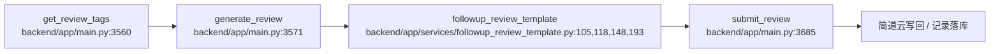
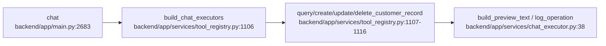
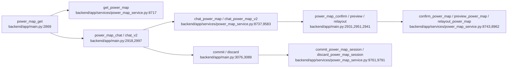

# 01_DATAFLOW

## 核心流程

### 1) transcripts -> 提取 -> 比对 -> 审核卡片
- 入口：`backend/app/main.py:1505` `transcript_upload`
- 钉钉入口：`backend/app/main.py:1584` `transcript_dingtalk_fetch`
- 入库/列表：`backend/app/main.py:1616` `list_transcripts`
- 详情：`backend/app/main.py:1655` `get_transcript`
- 启动分析：`backend/app/main.py:1755` `start_transcript_analysis`
- 后台主线：`backend/app/services/analysis_pipeline.py:31` `run_analysis_pipeline`
- 提取：`backend/app/main.py:2430` `extraction_task` -> `run_extraction_task`
- 比对：`backend/app/main.py:2455` `comparison_task`
- 审核卡片缓存：`backend/app/main.py:2494` `OPERATION_CARD_STORE`
- 状态：`backend/app/main.py:2677` `operations_status`

```mermaid
flowchart LR
  A[transcript_upload / dingtalk_fetch\nbackend/app/main.py:1505,1584] --> B[list_transcripts / get_transcript\nbackend/app/main.py:1616,1655]
  B --> C[start_transcript_analysis\nbackend/app/main.py:1755]
  C --> D[run_analysis_pipeline\nbackend/app/services/analysis_pipeline.py:31]
  D --> E[extraction_task / run_extraction_task\nbackend/app/main.py:2430,2308]
  E --> F[comparison_task\nbackend/app/main.py:2455]
  F --> G[OPERATION_CARD_STORE\nbackend/app/main.py:2494]
  G --> H[operations_review / execute_operations\nbackend/app/main.py:2540,2571]
```

### 2) review -> 生成跟进记录 -> 简道云提交
- 审核标签：`backend/app/main.py:3560` `get_review_tags`
- 生成：`backend/app/main.py:3571` `generate_review`
- 提交：`backend/app/main.py:3685` `submit_review`
- 兼容入口：`backend/app/main.py:3889` `followup_generate` / `followup_submit`
- 模板服务：`backend/app/services/followup_review_template.py:105` `load_followup_review_template`, `:118` `save_followup_review_template`, `:148` `build_followup_review_system_prompt`, `:193` `render_followup_review_record`
- 记录结构：`backend/app/services/followup_service.py:103` `_build_review_record_text`, `:167` `FollowupService`

### 3) chat -> 工具调用 -> 客户记录写入
- 入口：`backend/app/main.py:2683` `chat`
- 工具注册：`backend/app/services/tool_registry.py:1106` `build_chat_executors`
- 关键工具：`backend/app/services/tool_registry.py:1107` `query_customer_records`, `:1110` `create_customer_record`, `:1113` `update_customer_record`, `:1116` `delete_customer_record`
- 执行器提示：`backend/app/services/prompts.py:174` / `180` / `181`
- 预览文本：`backend/app/services/chat_executor.py:38` `build_preview_text`

### 4) power-map -> 读取/聊天/确认/预览/提交
- 读取：`backend/app/main.py:2869` `power_map_get`
- 聊天：`backend/app/main.py:2918` `power_map_chat`
- 确认：`backend/app/main.py:2931` `power_map_confirm`
- 重排：`backend/app/main.py:2941` `power_map_relayout`
- 预览：`backend/app/main.py:2951` `power_map_preview`
- SSE V2：`backend/app/main.py:2997` `power_map_chat_v2`
- 提交/丢弃：`backend/app/main.py:3076` `power_map_commit`, `:3089` `power_map_discard`
- 核心服务：`backend/app/services/power_map_service.py:8717` `get_power_map`, `:8737` `chat_power_map`, `:8743` `confirm_power_map`, `:8962` `preview_power_map`, `:9583` `chat_power_map_v2`, `:9761` `commit_power_map_session`, `:9791` `discard_power_map_session`

### 5) customers -> 缓存索引 -> 档案/联系人/任务
- 列表：`backend/app/main.py:1791` `customers_list`
- 搜索：`backend/app/main.py:1982` `search_customers`
- 公司搜索：`backend/app/main.py:1964` `company_search`
- 档案：`backend/app/main.py:2029` `customer_profile`
- 预期/场景：`backend/app/main.py:2070` `customer_yuqi`, `:2092` `customer_changjing`
- 联系人/任务：`backend/app/main.py:2114` `customer_contacts`, `:2138` `customer_tasks`
- 切换：`backend/app/main.py:2164` `customer_switch`
- 缓存刷新：`backend/app/main.py:640` `refresh_customer_index_cache`, `:1423` `admin_refresh_cache`

### 6) admin/config -> 密钥 -> runtime config
- 配置读取：`backend/app/main.py:1167` `get_admin_config`
- 配置保存：`backend/app/main.py:1193` `save_admin_config`
- LLM 配置：`backend/app/main.py:1233` `get_llm_config`, `:1254` `save_llm_config`
- 密钥：`backend/app/main.py:1201-1202`, `:1260-1261` `encrypt_secret`
- 运行时拼装：`backend/app/main.py:414` `get_jiandaoyun_runtime_config`
- 模型配置影响：`backend/app/main.py:3415` `analytics_system_accuracy` 读 `prompt_version`

### 7) analytics / debug / sandbox
- 概览：`backend/app/main.py:3409` `analytics_business_overview`
- 准确率：`backend/app/main.py:3415` `analytics_system_accuracy`
- prompt 对比：`backend/app/main.py:3421` `analytics_prompt_compare`
- 导出：`backend/app/main.py:3519` `analytics_export`
- sandbox：`backend/app/main.py:3124` `power_map_sandbox`, `:3202` `power_map_sandbox_proxy`, `:3256` `sandbox_render`
- mock BI：`backend/app/main.py:3308` 起一组 `mock_bi_*`

## 关键落点
- 所有 DB 读写都走 `Session = Depends(get_db)`
- 简道云写回核心链路最终汇聚到 `operation_executor` / `jiandaoyun_writer`
- `transcripts` 和 `power-map` 都有本地缓存/会话态，重启会影响内存态数据

## 日志与埋点

### 统一埋点入口
- `backend/app/services/tracing.py:29` `new_trace`
- `backend/app/services/tracing.py:35` `current_trace`
- `backend/app/services/tracing.py:39` `emit`
- `backend/app/services/tracing.py:49` `emit_llm`
- 说明：统一写到 `zhidang.metrics` logger，payload 内固定带 `_metric`、`trace_id`、`ts`

### transcripts / review 链路留痕
- 提取链路 trace：`backend/app/services/analysis_pipeline.py:54` `new_trace("ext")`
- review 生成 trace：`backend/app/main.py:3584` `new_trace("rvw")`
- review 提交 trace：`backend/app/main.py:3813` `new_trace("rwj")`
- review 事件：`backend/app/main.py:3586`, `3676`, `3680`
- review LLM 事件：`backend/app/main.py:3643`, `3653`, `3661`
- 提取/比对进度缓存：`backend/app/main.py:223` `TASK_PROGRESS`
- 操作卡缓存：`backend/app/main.py:269` `OPERATION_CARD_STORE`
- 业务审计事件：`backend/app/main.py:791` `emit_event`
- 提取完成事件：`backend/app/main.py:2451` `extraction.completed`
- 比对完成事件：`backend/app/main.py:2497` `comparison.completed`

### Power Map 链路留痕
- session 生成/存取：`backend/app/services/power_map_service.py:103` `_new_session_id`, `:107` `_get_session`, `:117` `_store_session`
- harness-stream 恢复/创建 session：`backend/app/services/power_map_service.py:8461`, `8495-8499`
- chat_v2 每次新建 session：`backend/app/services/power_map_service.py:9648-9656`
- chat_v2 关键日志：`[DEBUG-J] 2.SESSION_INIT` 在 `backend/app/services/power_map_service.py:9650-9652`
- graph_state 快照带 `session_id`：`backend/app/services/power_map_service.py:8354`
- debug 查看当前 ctx：`backend/app/main.py:3046` `/api/v1/power-map/debug/dump_ctx`
- sandbox 注入当前 session：`backend/app/main.py:3124`, `3168`, `3315-3318`
- commit/discard 会清理 session：`backend/app/services/power_map_service.py:9761`, `9791`

### 推荐 debug 关键词
- `trace_id=`
- `session_id=`
- `_metric`
- `review_generate_start`
- `review_llm_attempt_start`
- `extraction.completed`
- `comparison.completed`
- `[DEBUG-J]`
- `harness-stream`
- `chat_v2`
