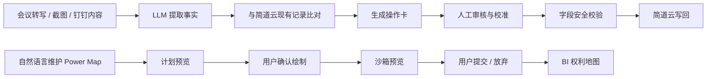
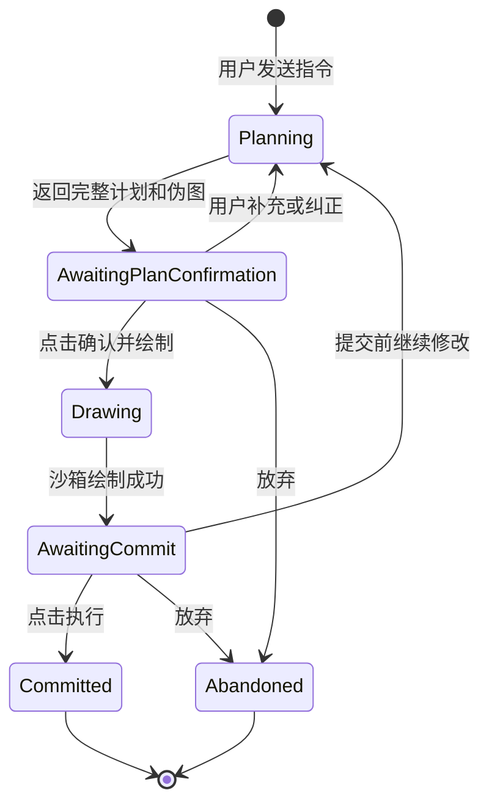

# 智档开发交接说明

> 适用版本：`master` / `3e7bb5f`
> 整理日期：2026-08-17
> 维护原则：本文描述当前代码和已验证的运行方式；历史方案只作为背景，不应覆盖本文中的现状说明。

## 1. 入口与版本

- GitHub 仓库：[gustfanruan-ctrl/zhidang](https://github.com/gustfanruan-ctrl/zhidang)
- 当前主线：[master](https://github.com/gustfanruan-ctrl/zhidang/tree/master)
- 当前提交：[3e7bb5f - fix: validate power map persistence](https://github.com/gustfanruan-ctrl/zhidang/commit/3e7bb5fccd37899ee194ba44a3750a463864fff0)
- Power Map 核心代码：[power_map_service.py](https://github.com/gustfanruan-ctrl/zhidang/blob/master/backend/app/services/power_map_service.py)
- Power Map 前端：[PowerMapV2Page.vue](https://github.com/gustfanruan-ctrl/zhidang/blob/master/frontend/src/pages/PowerMapV2Page.vue)

近期重要提交：

| 提交 | 作用 |
|---|---|
| [`0045c97`](https://github.com/gustfanruan-ctrl/zhidang/commit/0045c97) | Power Map 计划确认流程 |
| [`fea14e1`](https://github.com/gustfanruan-ctrl/zhidang/commit/fea14e1) | 平行部门与人员汇报语义提示 |
| [`c0413b5`](https://github.com/gustfanruan-ctrl/zhidang/commit/c0413b5) | 计划 JSON 容错解析 |
| [`7fc826d`](https://github.com/gustfanruan-ctrl/zhidang/commit/7fc826d) | iframe 权利地图保存代理 |
| [`40007d2`](https://github.com/gustfanruan-ctrl/zhidang/commit/40007d2) | 宽组织图的平行部门换行 |
| [`d52a8af`](https://github.com/gustfanruan-ctrl/zhidang/commit/d52a8af) | Power Map 删除意图执行 |
| [`b83ded5`](https://github.com/gustfanruan-ctrl/zhidang/commit/b83ded5) | 保留已有布局、支持组织图截图计划 |
| [`b8342e2`](https://github.com/gustfanruan-ctrl/zhidang/commit/b8342e2) | 确认计划后的布局执行与安全收敛 |
| [`3e7bb5f`](https://github.com/gustfanruan-ctrl/zhidang/commit/3e7bb5f) | Power Map 持久化结果校验 |

## 2. 系统定位

智档是面向客户成功团队的 AI 辅助运营系统，主链路是：



系统不只是聊天界面。LLM 的输出必须经过结构化解析、字段映射、人工确认和写回安全层，才能进入简道云或 BI。

## 3. 代码地图

### 后端

| 路径 | 职责 |
|---|---|
| `backend/app/main.py` | 真实 FastAPI 入口、鉴权、业务路由、审计、静态代理 |
| `backend/app/services/power_map_service.py` | Power Map 计划、LLM 工具循环、图变更、布局、沙箱会话 |
| `backend/app/services/analysis_pipeline.py` | 转写后的提取与比对后台流水线 |
| `backend/app/services/agent_runner.py` | 通用 Agent 工具调用循环 |
| `backend/app/services/prompts.py` | 提取、比对、聊天和业务语义提示词 |
| `backend/app/services/tool_registry.py` | 工具注册、字段别名、字段安全匹配 |
| `backend/app/services/operation_executor.py` | 审核通过后的 create/update/skip 写回执行 |
| `backend/app/services/jiandaoyun_client.py` | 简道云 HTTP 客户端，包含接口兼容处理 |
| `backend/app/services/jiandaoyun_writer.py` | 对简道云写入动作的统一封装 |
| `backend/app/services/field_safety.py` | 字段级安全校验 |
| `backend/app/config/jiandaoyun_field_mapping.json` | 表单、entry_id、widget 和字段映射 |
| `backend/app/models.py` | SQLAlchemy 数据模型 |

### 前端

| 路径 | 职责 |
|---|---|
| `frontend/src/App.vue` | 全局壳、登录、客户选择、路由框架 |
| `frontend/src/pages/TranscriptsPage.vue` | 转写、跟进记录、操作卡查看与人工校准 |
| `frontend/src/pages/ReviewPage.vue` | 审核记录与跟进结果 |
| `frontend/src/pages/ChatPage.vue` | 客户档案自然语言维护 |
| `frontend/src/pages/PowerMapPage.vue` | 传统 Power Map 维护入口 |
| `frontend/src/pages/PowerMapV2Page.vue` | 当前 Power Map 页面与 iframe 沙箱 |
| `frontend/src/pages/ChatV2Panel.vue` | Power Map V2 对话、计划确认、图片输入 |
| `frontend/src/stores/powerMapChat.js` | Power Map 对话状态和 session/plan 状态 |
| `frontend/src/services/powerMapChatV2.js` | Power Map V2 SSE 请求与提交接口 |

### 不要混淆的入口

- 生产后端入口是 `backend/app/main.py`。
- 根目录的 `main.py` 是早期独立 demo，不是当前生产应用入口。
- `backend/app/static/sandbox/` 是沙箱静态资源目录；生产页面通过后端代理加载相关资源，不能把普通前端路由误当成 BI 原页面。

## 4. 主要业务流程与 API

### 4.1 转写、提取、审核、写回

1. `POST /api/v1/transcript/upload` 上传转写或图片。
2. `POST /api/v1/transcripts/{transcript_id}/analyze` 启动分析。
3. 后台调用 `analysis_pipeline`，先提取事实，再和简道云记录比对。
4. `POST /api/v1/operations/review` 生成或读取待审核操作卡。
5. 用户在前端审核、修改操作类型和字段。
6. `POST /api/v1/operations/execute` 统一调用 `operation_executor` 写回。

关键状态：

- `OPERATION_CARD_STORE`：当前运行进程内的操作卡缓存。
- `TASK_PROGRESS`：提取、比对进度缓存。
- `operation_card_logs` / `OperationLog`：数据库审计与执行记录。
- 操作卡人工校准会保留 `original_operation_type` 和 `operation_type_calibrated`。
- `skip` 是明确的批准结果，执行器直接返回 `execute_status=skipped`，不能降级成 update。

### 4.2 预期表与场景表转换

预期和场景不是同一张表，互转时必须经过卡片转换层，不能直接复用另一张表的字段：

- 表单和 widget 以 `jiandaoyun_field_mapping.json` 为准。
- 预期卡与场景卡的 `target_form`、业务 ID、关联字段、标题字段分别处理。
- 场景卡创建时需要绑定客户，并根据卡片上的 `related_yuqi_card_id` 或 `related_yuqi_id` 解析预期记录。
- 场景写入时会把预期的业务 ID 写入场景关联字段；若关联目标无法解析，应记录失败，不能静默写空。
- 创建成功后的 `data_id` 和业务 ID 会回填到当前批次的卡片上下文，供后续卡片关联。

涉及位置：

- `backend/app/main.py`：卡片转换、审核和提交入口。
- `backend/app/services/operation_executor.py`：顺序写入、关联 ID 解析和最终写回。
- `backend/app/config/jiandaoyun_field_mapping.json`：两张表的真实字段映射。

### 4.3 跟进记录

- 生成：`POST /api/v1/review/generate`。
- 提交：`POST /api/v1/review/submit`。
- 兼容入口：`POST /api/v1/followup/generate`、`POST /api/v1/followup/submit`。
- 业务实现：`backend/app/services/followup_service.py`。
- 模板实现：`backend/app/services/followup_review_template.py`。

跟进记录的结构化结果和写回字段也要经过字段映射及安全校验；修改表单字段时需要同步检查 `tool_registry.py` 和 `prompts.py`。

## 5. Power Map V2 当前实现

### 5.1 三阶段交互

当前推荐使用 `chat_v2` 的三阶段流程：



API：

- `POST /api/v1/power-map/{company_id}/chat_v2`：返回 SSE 计划预览，首次不修改图。
- `POST /api/v1/power-map/{company_id}/chat_v2/confirm-plan`：用户明确确认后绘制沙箱。
- `POST /api/v1/power-map/{company_id}/commit`：把当前未提交 session 写回 BI。
- `POST /api/v1/power-map/{company_id}/discard`：丢弃当前 session。
- `GET /api/v1/power-map/{company_id}`：读取生产图。
- `GET /api/v1/power-map/{company_id}/bi-com-id`：生成或读取 iframe 使用的 BI 地址。
- `GET /api/v1/power-map/debug/dump_ctx`：调试当前上下文，生产排查需谨慎使用。

状态字段：

- `plan_id`：计划草稿 ID。
- `session_id`：未提交沙箱会话 ID。
- `harness_can_commit`：只有最后一次沙箱绘制成功且状态有效时才为真。
- `phase`：前端状态包括 planning、awaiting plan confirmation、executing、awaiting commit。

### 5.2 语义规则

Power Map 的组织关系以 LLM 的计划和用户确认结果为主，后端只做解析、执行和轻量提示，不自动替用户补边或删边。

- “平行部门”表示同层关系，部门之间没有默认上下级关系，也没有默认汇报线。
- “部门下面有小组”才表示部门层级。
- “负责人下面有人员”才表示人员汇报关系。
- `CIO`、`部长`、`组长` 等职位名称只是角色标签，不能单独推出跨部门汇报关系。
- 没有明确原文依据时，LLM 不应输出 `report_edges`。
- 伪图中分开显示“部门层级”“平行关系”“人员汇报线”，先让用户确认语义，再绘图。
- 如果用户确认了错误的计划，系统仍按确认内容执行；纠偏入口是计划阶段的多轮补充。

### 5.3 布局规则与已知行为

- 已有图存在节点时，修改操作应保留既有坐标；不要因为改名、加人或改关系而自动把整张图径向重排。
- 空图首次生成时可以使用 radial layout。
- 新节点使用空位搜索，尽量避开已有节点。
- 平行部门较多时，布局算法按宽度换行；不要把一长串平行部门压成不可读的单行。
- 人员汇报线和部门包含关系是两类不同边，排查时要分别看 `report_edges` 和部门父子关系。
- 组织图截图可随计划发送，前端最多保留 3 张图片；支持企业微信、钉钉等机构图作为语义参考，但截图只用于理解结构，不承诺原坐标完全复刻。
- 没有手机号的新增联系人使用占位手机号 `999999999999`；后续 CRM 联系人匹配成功时应覆盖为真实手机号。

### 5.4 Power Map 调试顺序

遇到“图不对”时按下面顺序看，避免直接从最终截图反推：

1. 看 `plan_preview` 的完整伪图，确认 LLM 是否理解了部门层级、平行关系和人员汇报。
2. 看日志里的 `plan_id`、`session_id`、`intent`、`report_edges`。
3. 确认用户是否点击了“确认并绘制”，不要把计划阶段当成已执行。
4. 对比 `radial_layout_used`、`preserved_existing_layout` 和最终 `graph_state`。
5. 最后再看沙箱截图、BI iframe 和写回结果。

推荐日志关键词：

```text
chat_v2
plan_preview
confirm-plan
[DEBUG-J]
session_id=
plan_id=
report_edges
radial_layout_used
preserved_existing_layout
harness_can_commit
repeated_tool_call
max_rounds_hit
```

## 6. 本地开发

### 6.1 前置条件

- Python 3.12 或兼容版本。
- Node.js 与 npm。
- Docker Desktop（完整栈运行需要）。
- 本地 `.env` 只放在工作区，不提交密钥。

### 6.2 Docker 完整运行

```bash
docker compose up --build
```

默认服务：

- 前端：`http://localhost:8080`
- 后端：`http://localhost:8000`
- PostgreSQL：仅绑定本机 `127.0.0.1:5432`

### 6.3 分开运行

```bash
pip install -r requirements.txt
uvicorn backend.app.main:app --reload --host 0.0.0.0 --port 8000
```

另开终端：

```bash
cd frontend
npm install
npm run dev
```

本地快速开发可以使用 SQLite：

```bash
DATABASE_URL=sqlite:///./zhidang.db
```

数据库迁移：

```bash
alembic upgrade head
```

### 6.4 验证命令

```bash
python -m pytest backend/tests/test_power_map_plan_execution.py
python -m pytest backend/tests/test_power_map_business_semantics.py
python -m pytest backend/tests/test_power_map_radial_layout.py
python -m pytest backend/tests/test_power_map_service.py::TestNodeIdGeneration
cd frontend
npm run build
```

改动涉及公共 API、字段映射、执行器或前端流程时，应再运行完整后端测试：

```bash
python -m pytest backend/tests
```

## 7. 生产环境交接

### 7.1 运行位置

- 服务器：`47.98.102.197`
- 公网入口：[https://47-98-102-197.sslip.io](https://47-98-102-197.sslip.io)
- 权利地图：[https://47-98-102-197.sslip.io/power-map](https://47-98-102-197.sslip.io/power-map)
- 生产目录：`/opt/zhidang`
- 后端容器：`zhidang-backend-1`
- 前端容器：`zhidang-frontend-1`
- 数据库容器：`zhidang-postgres-1`

SSH 私钥使用本机已有的受控配置，不要把私钥、JWT_SECRET、LLM key 或简道云 key 写入仓库。通用形式：

```bash
ssh -i <本机私钥> root@47.98.102.197
cd /opt/zhidang
docker ps
```

### 7.2 部署原则

后端源码不是宿主机 bind mount。只把经过测试的文件复制进容器，然后重启后端：

```bash
docker cp backend/app/main.py zhidang-backend-1:/app/backend/app/main.py
docker cp backend/app/schemas/__init__.py zhidang-backend-1:/app/backend/app/schemas/__init__.py
docker cp backend/app/services/power_map_service.py zhidang-backend-1:/app/backend/app/services/power_map_service.py
docker compose restart backend
```

涉及其他后端服务时，按相同方式逐文件复制，不能只更新宿主机目录后假设容器已经生效。

前端 `frontend/dist` 是 nginx 的 bind mount：

- 先在本地 `npm run build`。
- 只覆盖文件或把构建产物解压到现有目录。
- 禁止对 `frontend/dist` 执行 `rm -rf` 后重新创建目录，否则会破坏绑定目录和 nginx 看到的 inode。
- 更新后执行 `docker exec zhidang-frontend-1 nginx -s reload`，必要时再重启前端容器。

### 7.3 备份、检查与回滚

每次生产变更前，把将要覆盖的容器文件和 `frontend/dist` 备份到：

```text
/opt/zhidang/.deploy_backups/<timestamp>/
```

部署后至少检查：

```bash
curl -fsS http://127.0.0.1:8000/docs >/dev/null
curl -fsS http://127.0.0.1:8080/power-map >/dev/null
docker ps
docker logs --tail 200 zhidang-backend-1
```

外网检查：

```bash
curl -I https://47-98-102-197.sslip.io/power-map
```

回滚时从对应备份目录恢复同名文件，再重启受影响的容器。不要用 `git reset --hard` 覆盖生产目录，也不要删除未知来源的生产备份。

### 7.4 当前生产注意事项

- Power Map 计划、沙箱 session、审核操作卡等部分状态在内存中，单 worker 重启可能使未提交会话或待审核缓存失效。
- 生产启动日志曾出现 sandbox manifest mismatch 警告；目前属于 warn-only，排查时要确认静态资源版本、容器内文件和宿主机 bind mount 是否一致。
- 当前生产部署不是“容器自动跟随 Git”；必须以容器内文件校验为准。
- 生产调试优先读取日志和只读接口，写入型验证要明确客户、表单和回滚方式。

## 8. 安全与不可破坏约束

1. 简道云写入必须经过 `operation_executor`、`JiandaoyunWriter` 和 `field_safety`，不能从路由或脚本直接调用客户端写入。
2. 新增字段时要同步检查 `jiandaoyun_field_mapping.json`、`tool_registry.py` 和 `prompts.py`。
3. API key、密码、JWT secret 使用现有加密配置保存，禁止明文进入 Git、日志或截图。
4. Power Map 语义问题优先优化 prompt、Few-shot、伪图和用户确认，不要为了修一个案例增加硬编码的自动删边、补边规则。
5. 不要把 `skip` 当作失败，也不能因为缺少 `data_id` 把人工选择的 create 降级为 update。
6. 修改生产前必须先确认实际运行文件，避免只改本地源码而容器仍运行旧代码。

## 9. 常见问题定位表

| 现象 | 先看什么 | 常见原因 |
|---|---|---|
| 页面白屏 | 浏览器 Network、nginx 日志、`/power-map` 返回值 | 前端构建产物、代理路由或静态资源加载失败 |
| 登录反复跳转 | `/api/v1/auth/login`、SSO 回调、cookie/JWT | 入口协议、代理转发或 token 域不一致 |
| Power Map 计划正常但图错 | `plan_preview`、`report_edges`、`graph_state` | LLM 语义误判、用户确认了错误计划或执行态不是最新 |
| 平行部门变成上下级 | 伪图的部门层级/平行关系分区 | prompt 没有保留平行边界，或把职位误当汇报依据 |
| 人员汇报线缺失 | `report_edges` 与 `reason` | 原文没有明确关系，模型没有给出有依据的边 |
| 已有图被重新铺开 | `preserved_existing_layout`、`radial_layout_used` | 误触发 radial layout 或执行上下文没有加载已有图 |
| `repeated_tool_call` / 达到轮数 | `[DEBUG-J]`、`max_rounds_hit`、session 生命周期 | LLM 工具循环未收敛、上下文过大或沙箱工具失败 |
| 计划 JSON 解析失败 | 原始 LLM 输出、容错解析日志 | JSON 被 Markdown 包裹、引号/逗号不完整或输出过长 |
| iframe 保存按钮不可用 | `/api/v1/power-map/.../bi-com-id`、sandbox proxy | 第三方资源跨域或后端 proxy/静态资源版本不一致 |
| 操作卡写错表 | `target_form`、转换后的 card、mapping 配置 | 预期/场景字段直接复用，或 lookup widget 没有随表单切换 |
| 场景关联预期为空 | 执行顺序、`related_yuqi_card_id`、`expect_id` | 预期未先创建、业务 ID 未解析或关联字段未写入 |

## 10. 现有资料索引

以下资料保留作为专题深挖入口：

- [快速索引](../00_QUICKREF.md)
- [系统数据流](../01_DATAFLOW.md)
- [函数索引](../02_FUNCTION_INDEX.md)
- [症状排查地图](../03_SYMPTOM_MAP.md)
- [危险区域清单](../05_DANGER_ZONES.md)
- [历史交接说明](../HANDOFF.md)
- [主平台迁移交接](../HANDOFF_MIGRATION_TO_MAIN_PLATFORM.md)
- [决策与实施记录](./decisions/)

历史文档可能包含旧分支、旧行号或已经解决的问题。发生冲突时，以当前 `master` 代码、测试结果、容器内实际文件和本文第 7 节的生产规则为准。

## 11. 新接手同事的建议顺序

1. 先读本文第 1、2、3 节，确认代码入口和版本。
2. 本地启动前端和后端，打开 `/docs`、客户列表和 Power Map 页面。
3. 跑 Power Map 相关测试，再看 `01_DATAFLOW.md` 与 `02_FUNCTION_INDEX.md`。
4. 处理线上问题时先拿 `trace_id`、`session_id`、`plan_id` 和客户 ID，再判断是 LLM、执行器、代理还是数据问题。
5. 涉及简道云写回时，先做只读比对和字段映射确认，最后才进行小范围人工验证。
6. 生产上线前走“备份 -> 文件校验 -> 重启受影响容器 -> 健康检查 -> 日志复核”的闭环。
